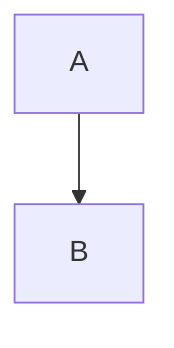

# Syntax zoo

%% An Obsidian comment with [[a link]] and - [ ] a task %%

==Highlighted== text, ~~struck~~ text, and a footnote.[^1]

$$
x = \frac{a}{b}
$$

[^1]: The footnote text.

```mermaid
graph TD; A-->B
```
